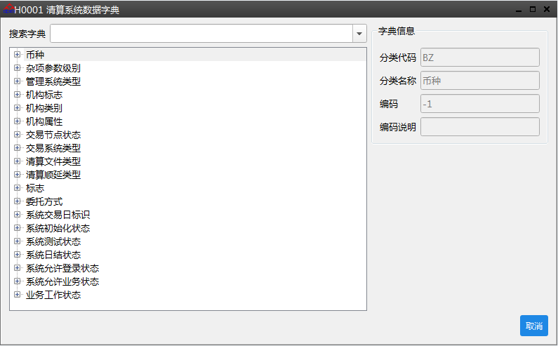
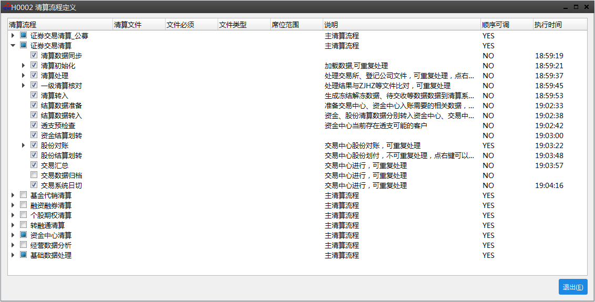
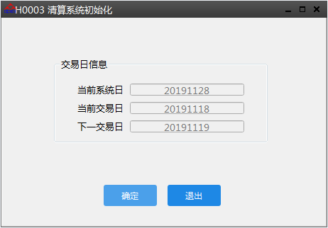
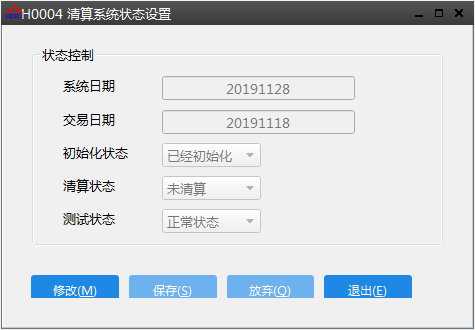
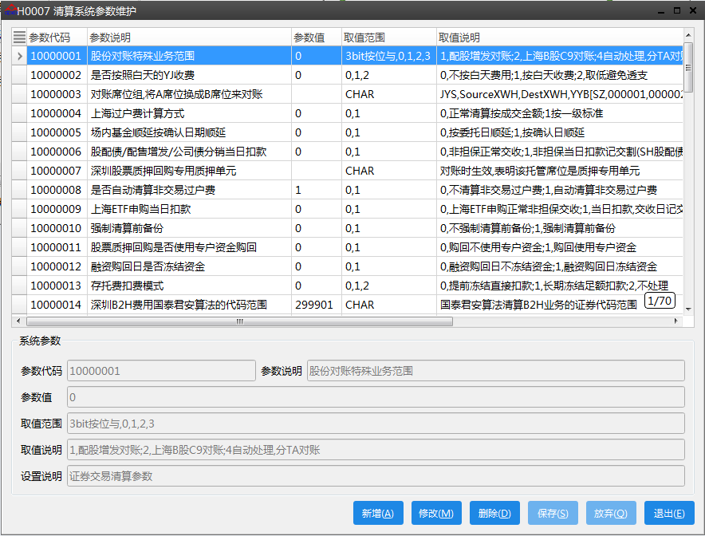
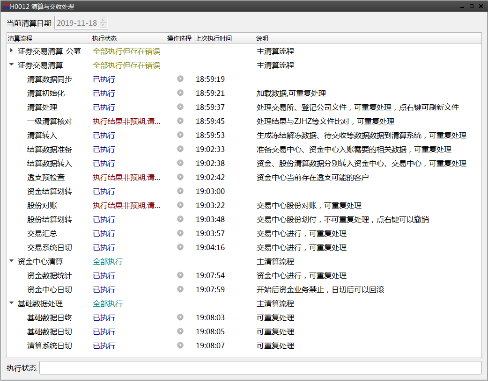
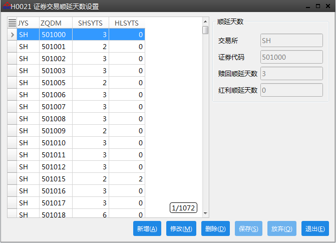

# 前端管理菜单

## 菜单列表

| 菜单编号 | 菜单名称                                      | 主要功能                             |
| -------- | --------------------------------------------- | ------------------------------------ |
| H0001    | [清算系统数据字典](#清算系统数据字典)         | 用于查看清算系统中定义的数据字典     |
| H0002    | [清算流程定义](#清算流程定义)                 | 定义清算流程步骤执行顺序             |
| H0003    | [清算系统初始化](#清算系统初始化)             | 每日清算前的清算初始化               |
| H0004    | [清算系统状态设置](#清算系统状态设置)         | 修改清算状态和测试状态               |
| H0007    | [清算系统参数维护](#清算系统参数维护)         | 维护清算系统参数                     |
| H0012    | [清算与交收处理](#清算与交收处理)             | 清算系统清算交收过程操作与监控功能   |
| H0021    | [证券交易顺延天数设置](#证券交易顺延天数设置) | 提供证券交易相关业务顺延天数设置功能 |

## 详细说明

### 清算系统数据字典



> 菜单通过调用`a5_ss_s_mgrpara.so`中实现的功能码`A5_SS_FO_PARA_LST_SJZD`**查询数据字典**，查询[数据库表](数据库表)`tSS_XTDM`

**例如**：机构类别（JGLB）0-总部，1-信息技术部，2-区域管理中心，3-营业部，4-服务部，6-经济业务部

分类代码：JGLB

分类名称：机构类别

编码：0

编码说明：总部

> 数据字典的添加直接采用数据库脚本。

------

### 清算流程定义



> 清算流程按清算节点进行划分，典型的按**证券交易、基金代销、融资融券、个股期权、软融通**等不同的业务品种进行划分，一般对应交易节点。此外还有**资金中心清算、经营数据分析、基础数据处理**等相对于各个交易节点的公共流程归类。

通过清算流程定义可以选择清算步骤，维护清算步骤中所需的清算文件，以及对部分步骤进行顺序调整。主要调用功能码如下：

**清算流程展示**

`A5_SS_FO_PARA_LST_FLOW`

**清算流程修改**

`A5_SS_FO_PARA_MOD_FLOW`

**清算流程增删**，本菜单主要用于调整流程顺序

`A5_SS_FO_PARA_ADD_FLOW`

`A5_SS_FO_PARA_DEL_FLOW`

**清算文件的增删改**

`A5_SS_FO_PARA_ADD_QSFILE`

`A5_SS_FO_PARA_MOD_QSFILE`

`A5_SS_FO_PARA_DEL_QSFILE`

> 清算流程涉及[数据库表](数据库表)`tSS_FLOW`，清算文件涉及`tSS_QSFILE`

添加清算文件时需要选择文件类型，这个文件类型影响清算文件处理，所以必须选择正确。文件类型的维护在[清算系统数据字典](#清算系统数据字典)中的**清算文件类型**。

### 清算系统初始化



> 清算系统初始化在当天清算之前执行

初始化显示使用**查询系统交易日**`A5_SS_FO_PARA_GET_JYR`，涉及[数据库表](数据库表)`tSS_XTZT`

点击“**确定**”按钮，调用功能码**清算系统初始化**`A5_SS_FO_SYS_INIT`，主要功能如下：

1. 查询输入日期是否为交易日

2. 验证当前状态

3. 置“初始化进行中”状态

4. 系统初始化，并置系统状态

   调用存储过程`pSS_SYSINIT`

   - 初始化数据库`a5_settlement`的序列
   - 删除[数据库表](数据库表)**用户操作日志**`tSS_YHCZRZ`
   - `tSS_FLOW`中`STATUS`置为**0**，`FSSJ`置为**空**
   - `tSS_XTZT`中`CSHZT`置为**2已清算**状态

### 清算系统状态设置



> 修改清算状态和测试状态

使用`A5_SS_FO_PARA_MOD_XTZT`修改[数据库表](数据库表)`tSS_XTZT`相关字段

### 清算系统参数维护



用于维护[数据库表](数据库表)`tSS_XTCS`

通过以下功能码进行增删改查的维护

`A5_SS_FO_PARA_ADD_XTCS`

`A5_SS_FO_PARA_DEL_XTCS`

`A5_SS_FO_PARA_MOD_XTCS`

`A5_SS_FO_PARA_LST_XTCS`

清算系统参数通过下列函数进行初始化，将数据库数据加载到内存

```c++
bool CQSPara::InitXTCS(long nQSRQ, string &sErrMsg);
```

其他程序通过下列函数进行获取

```c++
CStdString CQSPara::GetXTCS(const CStdString &sCSDM, const CStdString &sDefault);
```

具体可参考[清算中间件](清算中间件)

### 清算与交收处理



> ​        提供清算系统清算交收过程操作与监控功能  

选择某个流程，右击菜单可选操作“启动”、“回滚”、“查看文件”、“浏览执行结果”、“刷新界面”、“查看文件”  等功能

右击左侧“菜单”标题栏，可调取“输出窗口”和“监控日志”

根据不同的清算业务调用相应的功能码

| 清算业务     | 任务标识 | 调用功能码       |
| ------------ | -------- | ---------------- |
| 证券交易清算 | `SC`     | `A5_SS_BLF_ZQJY` |
| 基金代销清算 | `OF`     | `A5_SS_BLF_OFSS` |
| 融资融券清算 | `MR`     | `A5_SS_BLF_RZRQ` |
| 个股期权清算 | `OP`     | `A5_SS_BLF_GGQQ` |
| 基础数据处理 | `JC`     | `A5_SS_BLF_BASE` |
| 资金中心清算 | `FC`     | `A5_SS_BLF_FUND` |

具体功能码执行步骤参考[清算中间件](清算中间件)

### 证券交易顺延天数设置



> **赎回顺延天数**：赎回申请确认日算起，实际资金到帐的间隔天数（按开放日计算）  
>
> **红利顺延天数**：红利发放数据收到之日算起，实际资金到帐间隔天数（按开放日计算）  

用于维护[数据库表](数据库表)`tSC_SYTS`

通过以下功能码进行增删改查的维护

`A5_SS_FO_PARA_ADD_SCSYTS`

`A5_SS_FO_PARA_DEL_SCSYTS`

`A5_SS_FO_PARA_MOD_SCSYTS`

`A5_SS_FO_PARA_LST_SCSYTS`

清算系统参数通过下列函数进行初始化，将数据库数据加载到内存

```c++
bool CQSPara::InitXTCS(long nQSRQ, string &sErrMsg);
```

顺延数据的维护在每日清算中的**清算初始化**步骤中，通过读取`C2`文件更新数据库数据，详细过程参见[清算中间件](清算中间件)中的**清算初始化**章节