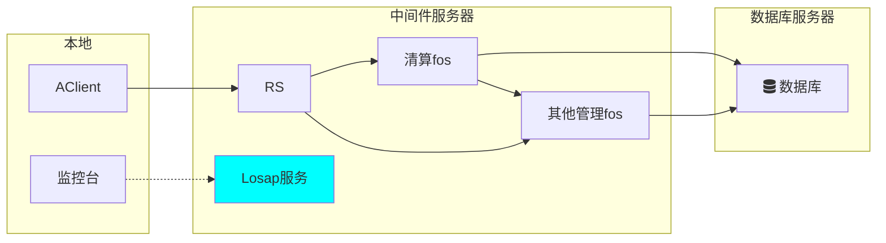

# 清算测试环境搭建

> 以清算测试为目的，搭建清算测试环境

## 部署方案



上图是典型的清算系统部署方案，可以通过合并中间件`FOS`、略去`RS`、将中间件和数据库部署在同一台服务器的方式进行最小化部署，前端可直连中间件`FOS`。

## 环境搭建准备

### 数据库

- `MySQL5.7.21`
- 指定某天清算前数据库备份`dmp`文件，包括基本的：`a5_manage`、`a5_sectrade`、`a5_fund`、`a5_settlement`
- 数据库镜像导入工具

### 中间件

- 包括`bin`、`cfg`、`svc`目录中的文件

### 清算文件

- 与数据库数据匹配的同天中登、交易所文件

### 证书

- 包括`cert`目录中的文件

### 客户端

- `AClient`客户端
- `AxSvrMgr`监控台

## 环境搭建步骤

### 数据库服务器

1. 数据库安装

2. 数据库数据导入

   使用`MySQL`客户端工具通过以下批处理命令进行`dmp`文件导入

   ```bash
   @echo off
   set CURRENT_DIR=%cd%
   set user=root
   set passwd=111111
   set ip=10.26.7.22
   set port=3306
   set restorecmd=mysql -h%ip% -P%port% -u%user% -p%passwd% 
   for %%x in ("%CURRENT_DIR%") do set CURRENT_DIR=%%~sx
   %restorecmd% A5_Fund --default-character-set=gbk < "%CURRENT_DIR%\A5_Fund.dmp"
   %restorecmd% A5_Manage --default-character-set=gbk < "%CURRENT_DIR%\A5_Manage.dmp"
   %restorecmd% A5_OFSTrade --default-character-set=gbk < "%CURRENT_DIR%\A5_OFSTrade.dmp"
   %restorecmd% A5_SECTrade --default-character-set=gbk < "%CURRENT_DIR%\A5_SECTrade.dmp"
   %restorecmd% A5_Settlement --default-character-set=gbk < "%CURRENT_DIR%\A5_Settlement.dmp"
   
   pause
   ```

### 中间件服务器

1. 拷贝`bin`、`cfg`、`svc`、`cert`目录中的文件至中间件服务器

2. 在`env.xml`文件中修改`losap`当前运行系统相关环境变量，主要为`LOCAL_IP`、`A5_MYSQL`、`A5_NAME`等

3. 在`cfg`目录中`procmgr.xml`文件中，配置`FOS`、`RS`等服务列表，用于`losap`启动需要用到的服务

   ```xml
   <ServerList>
       <ss_fos value="ss_fos.xml" />
       <fos value="fos.xml" />
       <rs value="rs.xml" />
   </ServerList>
   ```

4. 在`fos.xml`文件中修改，该`FOS`包含了除清算本身中间件以外的其他清算所用到的服务中间件

   ```xml
   <SYSTEM>
       <AutoRun Value="1"></AutoRun>
       <AutoRestart Value="1"></AutoRestart>
       <ReqTimeOut Value="10"></ReqTimeOut>
       <AUTH_TOKEN Value="../cert/axsvrauth.pfx" Pwd="{aes}TNlOCWgmeeZ0UIFVJpMIH1pQa/ykC" PwdType="2"/>
   </SYSTEM>
   ```

   `AutonRun`表示`losap`启动时是否自动加载本服务，1为自动加载，0为否

   `AUTH_TOKEN`记录所需加载的证书信息

   ```xml
   <Resource>
       <ABOSS Value="libadp_aboss.so">
           <A5_Manage InitNum="1" MinNum="1" MaxNum="20" ThreadBind="1" CheckTimer="1000">
               <Param Svr="${A5_MYSQL}" DataBase="A5_Manage" User="A5_Manage" Pwd="${A5_MYSQL_PWD}" PwdType="2" DBType="MYSQL"/>
           </A5_Manage>
       </ABOSS>
   </Resource>
   ```

   `Resource`配置`FOS`数据库连接信息

   ```xml
   <Module>
       <Module1 Value="../svc/a5_mc_s_authmgr.so"></Module1>
       <Module2 Value="../svc/a5_mc_s_mgrpara.so"></Module2>
       ...
   </Module>
   ```

   `Module`配置`FOS`加载的动态库信息

5. 在`ss_fos.xml`文件中专门配置清算中间件，主要配置`Resource`和`Module`

   ```xml
   <Resource>  
       <ABOSS Value="libadp_aboss.so">    
           <A5_Manage InitNum="1" LinkType="1" MaxNum="100" MaxTime="1000000" MinNum="20" ThreadBind="1" TimeOut="1000">
               <Param Svr="${A5_MYSQL}" DataBase="A5_Manage" User="A5_Manage" Pwd="${A5_MYSQL_PWD}" PwdType="2" DBType="MYSQL" />
           </A5_Manage>
           <A5_SECTrade InitNum="1" LinkType="1" MaxNum="100" MaxTime="1000000" MinNum="20" ThreadBind="1" TimeOut="1000">
               <Param Svr="${A5_MYSQL}" DataBase="A5_SECTrade" User="A5_SECTrade" Pwd="${A5_MYSQL_PWD}" PwdType="2" DBType="MYSQL" />
           </A5_SECTrade>
           <A5_Fund InitNum="1" LinkType="1" MaxNum="100" MaxTime="1000000" MinNum="20" ThreadBind="1" TimeOut="1000">
               <Param Svr="${A5_MYSQL}" DataBase="A5_Fund" User="A5_Fund" Pwd="${A5_MYSQL_PWD}" PwdType="2" DBType="MYSQL" />
           </A5_Fund>
           <A5_OFSTrade InitNum="1" LinkType="1" MaxNum="100" MaxTime="1000000" MinNum="20" ThreadBind="1" TimeOut="1000">
               <Param Svr="${A5_MYSQL}" DataBase="A5_OFSTrade" User="A5_OFSTrade" Pwd="${A5_MYSQL_PWD}" PwdType="2" DBType="MYSQL" />
           </A5_OFSTrade>
           <A5_SettleMent InitNum="100" LinkType="1" MaxNum="100000" MaxTime="1000000" MinNum="200" ThreadBind="100" TimeOut="1000">
               <Param Svr="${A5_MYSQL}" DataBase="A5_SettleMent" User="A5_SettleMent" Pwd="${A5_MYSQL_PWD}" PwdType="2" DBType="MYSQL" />
           </A5_SettleMent>
           <A5_DataCenter InitNum="1" LinkType="1" MaxNum="100" MaxTime="1000000" MinNum="20" ThreadBind="1" TimeOut="1000">
               <Param Svr="${A5_MYSQL}" DataBase="A5_DataCenter" User="A5_DataCenter" Pwd="${A5_MYSQL_PWD}" PwdType="2" DBType="MYSQL" />
           </A5_DataCenter>
       </ABOSS>
   </Resource>
   ```

   ```xml
   <Module>
       <Module1 Value="../svc/a5_ss_s_mgrpara.so" />
       <Module2 Value="../svc/a5_ss_ofss.so" />
       <Module3 Value="../svc/a5_ss_zqjy.so" />
       <Module4 Value="../svc/a5_ss_ggqq.so" />
       <Module5 Value="../svc/a5_ss_rzrq.so" />
       <Module6 Value="../svc/a5_ss_fund.so" />
       <Module7 Value="../svc/a5_ss_base.so" />
   </Module>
   ```

   由于清算系统用到了管理中心、资金中心的功能码，因此需将“其他管理FOS”配置为上级

   ```xml
    <AxSvr>
        <a5_fos>
            <Server LinkAddr="${LOCAL_IP}@${MC_FOS_PORT}/tcp" encrypt="" num="16" pwd="" ssl="0" type="0" user="" CheckLan="1" CheckLanSec="60" CheckLanTimeOut="15"></Server>
        </a5_fos>
    </AxSvr>
   ```

   

6. 由于配了两个`FOS`，因此需要配`RS`进行接入，在`rs.xml`中配置上级服务，即两个`FOS`

   ```xml
   <AxSvr>
       <a5_fos>
           <Server LinkAddr="${LOCAL_IP}@${MC_FOS_PORT}/tcp" encrypt="" num="16" pwd="" ssl="0" type="0" user="" CheckLan="1" CheckLanSec="60" CheckLanTimeOut="15"></Server>
       </a5_fos>
       <a5_ss_fos>
           <Server LinkAddr="${LOCAL_IP}@${SS_FOS_PORT}/tcp" encrypt="" num="1" pwd="" ssl="0" type="0" user="" CheckLan="1" CheckLanSec="60" CheckLanTimeOut="120"></Server>
       </a5_ss_fos>
   </AxSvr>
   ```

### 监控平台

`AxSvrMgr`监控台加载配置文件，注意配置的服务名与`FOS`、`RS`提供的服务名保持一致，即在中间件相关`xml`配置文件中的`NAME`字段

```xml
<NAMESERVICE>
    <REGION Value="${A5_NAME}fos"></REGION>
    <NAME Value="${A5_NAME}fos_${A5_IPNUM}"></NAME>
    <MASTER Value="1"></MASTER>
    <Addr Value=""></Addr>
    <RULE Value=""></RULE>
</NAMESERVICE>
```

## 服务启动停止

在中间件服务器`bin`目录中输入以下命令，`&`用于后台运行

```bash
./procmgr -d&
```

通过以下命令查询已启动服务

```bash
ps -ef|grep axsvr
```

通过以下命令结束所有服务

```bash
./clsall
```

在`procmgr`启动后，可以使用监控台手动启动停止中间件服务