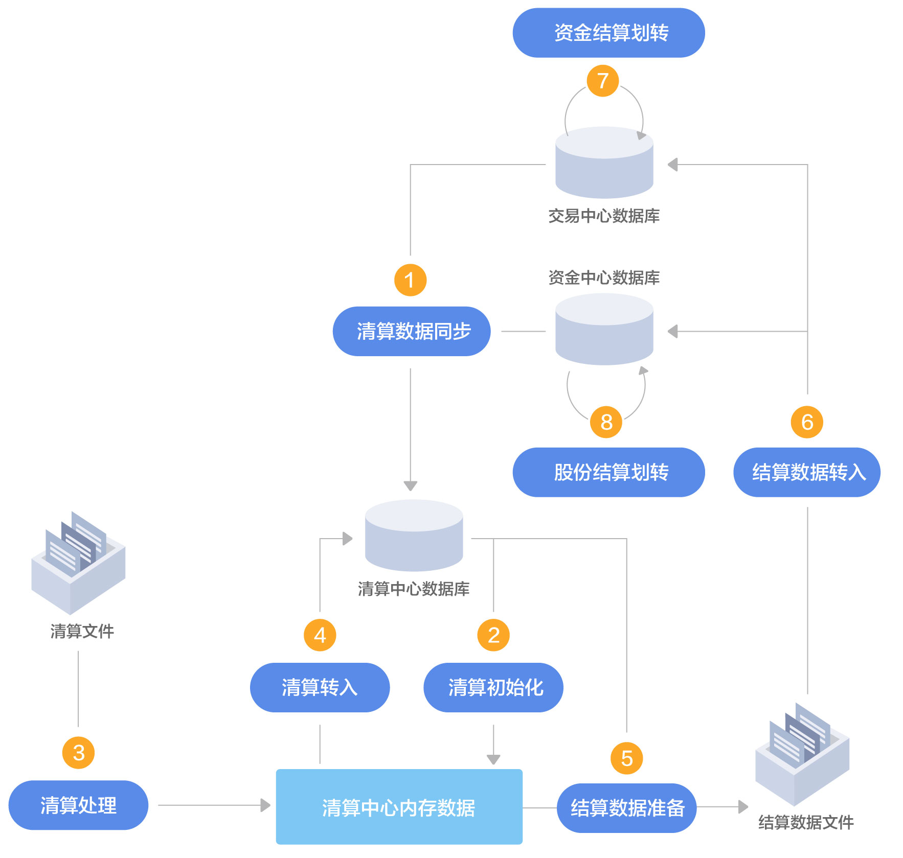

# 证券交易清算主流程

> 证券交易清算主流程是通过访问功能码`A5_SS_BLF_ZQJY`实现，对应函数  `a5_ss_blf_zqjy`

传入参数包括：

`FID_TYPE`任务类型：`PROCTYPE_DO`执行，`PROCTYPE_ROLLBACK`回滚

`FID_RWBH`任务编号：`SC01`等

`FID_QSRQ`清算日期

## 任务步骤总览

| 任务编号 | 任务名称                              | 可否重复执行 | 是否需要回滚 | 是否需要清算文件 | 前置任务                            |
| -------- | ------------------------------------- | ------------ | ------------ | ---------------- | ----------------------------------- |
| `SC01`   | [清算数据同步](#清算数据同步（SC01）) | ✔            | ✘            | ✘                | `SC09`,`SC10`未执行                 |
| `SC02`   | [清算初始化](#清算初始化（SC02）)     | ✔            | ✘            | ✔                | `SC01`已完成                        |
| `SC03`   | [清算处理](#清算处理（SC03）)         | ✔            | ✘            | ✔                | `SC02`已完成                        |
| `SC04`   | 一级清算核对                          | ✔            | ✘            | ✔                | `SC03`已完成                        |
| `SC05`   | [清算转入](#清算转入（SC05）)         | ✔            | ✘            | ✘                | `SC03`已完成                        |
| `SC06`   | [结算数据准备](#结算数据准备（SC06）) | ✔            | ✘            | ✘                | `SC05`已完成                        |
| `SC07`   | [结算数据转入](#结算数据转入（SC07）) | ✔            | ✘            | ✘                | `SC06`已完成 `SC09`,`SC10`未执行 |
| `SC08`   | 透支预检查                            | ✔            | ✘            | ✘                |                                     |
| `SC09`   | 资金结算划转                          | ✔            | ✔            | ✘                | `SC07`已完成                        |
| `SC10`   | 股份结算划转                          | ✔            | ✔            | ✘                | `SC07`已完成                        |
| `SC11`   | 股份对账                              | ✔            | ✘            | ✔                |                                     |
| `SC12`   | 交易汇总                              | ✔            | ✘            | ✘                | `SC10`已完成                        |
| `SC13`   | 交易数据归档                          | ✔            | ✔            | ✘                | `SC10`已完成 目前本任务不执行    |
| `SC14`   | 交易系统日切                          | ✔            | ✔            | ✘                | `SC12`已完成                        |

## 具体任务步骤

### 清算数据同步（SC01）

> 收盘后交易数据会落地到各个管理中心，清算中心将清算所需的数据同步到清算数据库

通过`Pro_SettleMent_SecDataCollect`函数实现，采用多线程方式，一个数据类型一个线程

操作前提：无，可重复执行

**主要步骤如下：**

> 通过中间临时文件进行数据库间数据同步

| 数据类型         | 导入表名               | 导出表名               | 说明                                                         |
| ---------------- | ---------------------- | ---------------------- | ------------------------------------------------------------ |
| 系统参数         | `tSC_JGGL`             | `tMC_JGGL`             | **机构管理**                                                 |
| 佣金参数         | `tSC_HLCBS`            | `tFC_HLCBS`            | **红利差别税** 主节点：采集排除`tFC_SC_QSNODES_KHXX`内客户 子节点：只采集本节点客户 |
| 客户交易控制     | `tSC_KHJYKZ_TMP`       | `tSC_KHJYKZ`           | **客户交易控制** 增量同步时为采集当天变动 主节点：采集排除`tSC_QSNODES_KHXX`内客户 子节点：只采集本节点客户 |
| 股东相关信息     | `tSC_GDH_TMP`          | `tSC_GDH`              | **证券账户_临时表** 增量同步时为采集当天变动 主节点：采集排除`tSC_QSNODES_KHXX`内客户 子节点：只采集本节点客户 |
|                  | `tSC_GDH_TMPEXCLUDE`   | `tSC_GDH`              | **证券账排除表_临时表** 增量同步时为采集当天变动 主节点同步 同步`tSC_QSNODES_KHXX`内客户 |
|                  | `tSC_GDH_DRZDJY`       | `tSC_GDH`              | **证券账户_当日指定交易** 采集`tSC_DRWT`中`JYLB`为9、10，`ZQDM`为799996-799999，`WTRQ`为清算当天 主节点：采集排除`tSC_QSNODES_KHXX`内客户 子节点：只采集本节点客户 |
|                  | `tSC_GDH_ZX`           | `tSC_GDH_ZX`           | **证券账户_当天注销** 只做增量同步 主节点：采集排除`tSC_QSNODES_KHXX`内客户 子节点：只采集本节点客户 |
|                  | `tSC_GDH_ZXEXCLUDE`    | `tSC_GDH_ZX`           | **证券账户排除表_当天注销** 只做增量同步 主节点同步 同步`tSC_QSNODES_KHXX`内客户 |
|                  | `tSC_RCZH`             | `tSC_RCZH`             | **容错账户** 主节点或非分批清算同步                       |
| 委托相关信息     | `tSC_DQSWT`            | `tSC_DRWT`             | **待清算委托** `SBJG<>0` 主节点：采集排除`tSC_QSNODES_KHXX`内客户 子节点：只采集本节点客户 |
|                  | `tSC_DQSWTSF`          | `tSC_DRWT`             | **待清算委托费** `SBJG<>0`、`WTSF>0` 主节点：采集排除`tSC_QSNODES_KHXX`内客户 子节点：只采集本节点客户 |
| 证券交易参数     | `tSC_ETF_JBXX`         | `tSC_ETF_JBXX`         | **ETF基本信息**                                              |
|                  | `tSC_SFBZ`             | `tSC_SFBZ`             | **收费标准**                                                 |
|                  | `tSC_GSXWXX`           | `tSC_GSXWXX`           | **公司行为信息**                                             |
|                  | `tSC_HLCS`             | `tSC_HLCS`             | **汇率参数**                                                 |
|                  | `tSC_GZYFXXX`          | `tSC_GZYFXXX`          | **国债预发行信息**                                           |
|                  | `tSC_ZQFXCS`           | `tSC_ZQFXCS`           | **证券发行参数**                                             |
|                  | `tSC_ZQDYBL`           | `tSC_ZQDYBL`           | **债券抵押比率**                                             |
| 证券交易系统参数 | `tSC_JYR`              | `tSC_JYR`              | **交易日**                                                   |
|                  | `tSC_ZQDM`             | `tSC_ZQDM`             | **证券代码**                                                 |
|                  | `tSC_QYXX`             | `tSC_QYXX`             | **权益信息**                                                 |
| 证券交易佣金参数 | `tSC_BZFL`             | `tSC_BZFL`             | **标准费率**                                                 |
|                  | `tSC_BZFL_ZQDM`        | `tSC_BZFL_ZQDM`        | **标准费率_证券代码**                                        |
|                  | `tSC_YJDJCS_JJJY`      | `tSC_YJDJCS_JJJY`      | **佣金定价参数_竞价交易**                                    |
|                  | `tSC_YJDJCS_JJJY_ZQDM` | `tSC_YJDJCS_JJJY_ZQDM` | **佣金定价参数_竞价交易__证券** 取`tSC_YJDJ_JJJY`中的`JSFS` |
|                  | `tSC_YJDJCS_CXYW`      | `tSC_YJDJCS_CXYW`      | **佣金定价参数_创新业务**                                    |
| 证券交易其他数据 | `tSC_ZYHGHYQS`         | `tSC_ZYHG`             | **股票质押回购合约清算** `SBJG>0`、`ZYLX<>1` 主节点：采集排除`tSC_QSNODES_KHXX`内客户 子节点：只采集本节点客户 |
|                  | `tSC_JYLB`             | `tSC_JYLB`             | **交易类别**                                                 |
|                  | `tSC_YDGHHYQS`         | `tSC_YDGH`             | **约定购回合约清算** `JSBZ=0`、`SBJG>0` 主节点：采集排除`tSC_QSNODES_KHXX`内客户 子节点：只采集本节点客户 |

**表格说明**：

如果为全量同步，则导入表名中略去`TMP`

在分批清算模式下，中间临时文件名中带有子节点号

> 执行存储过程`pSS_MERGESECUDATA`进行数据合并

1. 从`tSC_GDH`中删除`tSC_GDH_ZX`中存在的记录
2. 从`tSC_GDHEXCLUDE`中删除`tSC_GDH_ZXEXCLUDE`中存在的记录
3. 将`tSC_GDH_TMP`合并入`tSC_GDH`
4. 将`tSC_GDH_TMPEXCLUDE`合并入`tSC_GDHEXCLUDE`
5. 将`tSC_KHJYKZ_TMP`合并入`tSC_KHJYKZ`

### 清算初始化（SC02）

#### 数据初始化

> 通过`Do_SettleMent_SecDataInit`函数执行

1. **多线程将数据从数据库加载到内存**

| 数据类型                                |           数据加载函数           |
| --------------------------------------- | :------------------------------: |
| 系统参数`INITTHREADTYPE_XTCS`           |       `g_QSPara.InitXTCS`        |
| 佣金参数`INITTHREADTYPE_YJCS`           |       `g_QSPara.InitYJCS`        |
| 客户交易控制`INITTHREADTYPE_KHKZ`       |       `g_QSPara.InitKHKZ`        |
| 股东相关信息`INITTHREADTYPE_GDXX`       |       `g_WTInfo.InitGDXX`        |
| 委托相关信息`INITTHREADTYPE_WTXX`       |       `g_WTInfo.InitWTXX`        |
| 清算中心相关信息`INITTHREADTYPE_QSXX`   |       `g_QSPara.InitQSXX`        |
| 证券交易参数`INITTHREADTYPE_ZQJY`       |       `g_QSPara.InitZQJY`        |
| 排除股东相关信息`INITTHREADTYPE_GDXXEX` | `g_QSNodeManager.InitExcludeGDH` |

`g_QSPara.InitXTCS`

| 数据内容     | 内存变量      | 数据来源     | 说明                                          |
| ------------ | ------------- | ------------ | --------------------------------------------- |
| 机构管理     | `m_recJGGL`   | `tSC_JGGL`   |                                               |
| 交易日       | `m_recJYR`    | `tSC_JYR`    | `JYR`,`RQ`作为主键                            |
| 证券代码     | `m_recZQDM`   | `tSC_ZQDM`   | `JYS`,`ZQDM`作为主键                          |
| 交易类别     | `m_recJYLB`   | `tSC_JYLB`   | `JYLB`作为主键                                |
| 红利差别税   | `m_recHLCBS`  | `tSC_HLCBS`  |                                               |
| 顺延天数     | `m_recSYTS`   | `tSC_SYTS`   | `JYS`,`ZQDM`作为主键                          |
| 权益信息     | `m_recQYXX`   | `tSC_QYXX`   | `JYS`,`ZQDM`,`QYLB`作为主键                   |
| 系统参数     | `m_recXTCS`   | `tSS_XTCS`   |                                               |
| 系统特殊参数 | `m_recXTTSCS` | `tSS_XTTSCS` | `TSCSLB`,`TSCSBS`作为主键 未在`SC01`中同步 |
| 证券模板     | `m_recZQMB`   | `tSC_ZQMB`   | 未在`SC01`中同步                              |

`g_QSPara.InitYJCS`

| 数据内容             | 内存变量                | 数据来源               | 说明                                          |
| -------------------- | ----------------------- | ---------------------- | --------------------------------------------- |
| 标准佣金费率         | `m_recBZFL`             | `tSC_BZFL`             | `JYS`,`FLLB`,`JYLB`,`JYFLJB`,`JYFYDM`作为主键 |
| 证券代码费率         | `m_recBZFL_ZQDM`        | `tSC_BZFL_ZQDM`        | `JYS`,`ZQDM`,`JYLB`作为主键                   |
| 竞价交易佣金定价参数 | `m_recYJDJCS_JJJY`      | `tSC_YJDJCS_JJJY`      | `FLLB`(2位),`CLBH`(4位),`JYS`作为主键         |
| 证券代码佣金定价参数 | `m_recYJDJCS_JJJY_ZQDM` | `tSC_YJDJCS_JJJY_ZQDM` | `FLLB`(2位),`CLBH`(4位),`JYS`,`ZQDM`作为主键  |
| 创新业务佣金定价参数 | `m_recYJDJCS_CXYW`      | `tSC_YJDJCS_CXYW`      | `YJYWLB`(2位),`CLBH`(4位),`JYS`作为主键       |

`g_QSPara.InitKHKZ`

| 数据内容     | 内存变量      | 数据来源     | 说明 |
| ------------ | ------------- | ------------ | ---- |
| 客户交易控制 | `m_recKHJYKZ` | `tSC_KHJYKZ` |      |

`g_WTInfo.InitGDXX`

| 数据内容         | 内存变量          | 数据来源               | 说明                                                |
| ---------------- | ----------------- | ---------------------- | --------------------------------------------------- |
| 股东信息         | `m_recGDH`        | `tSC_GDH`,`tSC_KHJYKZ` | `GDH`,`JYS`,`XWH`作为主键1 `GDH`,`JYS`作为主键2  |
| 股东指定交易信息 | `m_recGDH_DRZDJY` | `tSC_GDH_DRZDJY`       | `GDH`,`JYS`,`XWH`作为主键1 `GDH`,`JYS`作为主键2 |
| 容错账户         | `m_recRCZH`       | `tSC_RCZH`             | `JYS`,`TGDY`作为主键                                |

`g_WTInfo.InitWTXX`

| 数据内容     | 内存变量     | 数据来源    | 说明                                      |
| ------------ | ------------ | ----------- | ----------------------------------------- |
| 待清算委托   | `m_recDQSWT` | `tSC_DQSWT` | `JYS`,`SBWTH`(扩充为16位),`BPGDH`作为主键 |
| 指定交易信息 | `m_recZDJY`  | `tSC_DQSWT` | `JYLB=9`指定交易 用于沪`BBD5`的处理    |

`g_QSPara.InitQSXX`

| 数据内容           | 内存变量   | 数据来源         | 说明                                                         |
| ------------------ | ---------- | ---------------- | ------------------------------------------------------------ |
| 待冲销资产修正记录 | `m_recDXZ` | `tSS_SC_DCXZCXZ` | `QSRQ`当天，`XZBZ=2` `QSRQ`非当天，`XZBZ=0` `ZCXZBH`作为主键 |
| 待调整本地持仓     | `m_recDTZ` | `tSS_SC_DTZBDCC` | `QSRQ`当天，`CXBZ=2` `QSRQ`非当天，`CXBZ=0` `JYS`,`GDH`,`TGDY`,`ZQDM`,`LTLX`,`GFXZ`作为主键 |
| 待交收数据         | `m_recDJS` | `tSS_SC_DJSQSZL` | `CJBH`不是'现金差额', '预估现金差额', '未开户资金支出', '未开户资金足额冻结', '未开户资金手工冻结' `JYRQ`,`SBWTH`(16位),`GDH`,`ZQDM`,`TGDY`作为主键 根据`QSRQ`,`JSRQ`,`JSBZ`判断是否进行数据处理，详情见下表 |

`tSS_SC_DJSQSZL`中字段满足以下条件进行数据处理

| `QSRQ` | `JSRQ`         | `JSBZ`  |      |
| ------ | -------------- | ------- | ---- |
| 当日   | —              | 1或2    |      |
| 非当日 | 等于或晚于当日 | 0或1或2 |      |
| 非当日 | 早于当日       | 0或1    |      |

`g_QSPara.InitZQJY`

| 数据内容                     | 内存变量          | 数据来源       | 说明                                                         |
| ---------------------------- | ----------------- | -------------- | ------------------------------------------------------------ |
| ETF信息                      | `m_recETF`        | `tSC_ETF_JBXX` | `JYS`,`JJDM`作为主键                                         |
| 收费标准                     | `m_recZHSF`       | `tSC_SFBZ`     | `YYB`，`SFXM`作为主键 计算转托管收费                      |
| 公司行为信息                 | `m_recGSXWXX`     | `tSC_GSXWXX`   | 对深港通或沪港通的供股配信息 `ZQDM`、`JCDM `分别表示供股权代码、上市代码 |
| 汇率参数                     | `m_recHLCS`       | `tSC_HLCS`     | 主要是用来计算深港沪港供配股的结算价格                       |
| 股票质押回购协议编号对照关系 | `m_recZYHGXYBHDZ` | `tSC_ZYHGHYQS` |                                                              |
| 上海国债预发行信息           | `m_recYFX`        | `tSC_GZYFXXX`  | `JYS`,`ZQDM`作为主键                                         |
| 证券发行参数                 | `m_recZQFXCS`     | `tSC_ZQFXCS`   | `JYS`,`ZQDM`,`FXFS`作为主键                                  |
| 债券抵押比例                 | `m_recZQDYBL`     | `tSC_ZQDYBL`   | `JYS`,`ZQDM`作为主键                                         |

`g_QSNodeManager.InitExcludeGDH`

| 数据内容                 | 内存变量          | 数据来源         | 说明                                               |
| ------------------------ | ----------------- | ---------------- | -------------------------------------------------- |
| 分批清算非主节点股东信息 | `m_recExcludeGDH` | `tSC_GDHEXCLUDE` | `GDH`,`JYS`,`XWH`作为主键1 `GDH`,`JYS`作为主键2 |

2. **初始化以下参数**

| 参数变量      | 参数代码             | 参数内容                         | 说明 |
| ------------- | -------------------- | -------------------------------- | ---- |
| `g_nGFDZx`    | `XTDM_ZQJY_GFDZEX`   | 股份对账特殊业务范围             |      |
| `g_nWTS1`     | `XTDM_ZQJY_WTS1`     | 是否按照白天的佣金收费           |      |
| `g_nGHFJS`    | `XTDM_ZQJY_SHGHFJS`  | 上海过户费计算方式               |      |
| `g_nWTYJCLBH` | `XTDM_ZQJY_WTYJCLBH` | 是否按照委托时的策略编号计算佣金 |      |
| `g_nZKBZS1`   | `XTDM_ZQJY_ZKBZS1`   | 计算佣金折扣是否按照标准S1计算   |      |
| `g_nXTTSCS`   | `XTDM_ZQJY_XTTSCS`   | 是否启用特殊系统代码             |      |
| `g_strSHRQZH` | `XTDM_ZQJY_SHRQZH`   | 上海融券专户                     |      |
| `g_strSZRQZH` | `XTDM_ZQJY_SZRQZH`   | 深圳融券专户                     |      |

3. **初始化融券专户股东号**

   通过`CWTInfo::InitRQZH`对`m_recDQSWT`的主键进行账户更改

4. **将A席位换成B席位来对账**

   通过杂项参数10000003`XTDM_ZQJY_DZXWZ`来配置

#### 数据化后处理

> 通过`Do_SettleMent_SecDataInitEx`函数执行，目前只处理基金文件进行顺延天数更新，沪伦通交易费用文件暂不处理

1. 处理清算文件

   处理`TA_C2`类型98，99文件，使用`ProcTAC2`函数处理，存储到`g_arInitExPrep`，包括以下字段信息

| 字段         | 类型  | 说明                            |
| ------------ | ----- | ------------------------------- |
| 标识串       | `C20` | `JYS+ZQDM`                      |
| 清算日期     | `I`   |                                 |
| 交易所       | `C2`  | 98文件为`SZ`，99文件为`SH`      |
| 证券代码     | `C10` | 取文件`FUNDCODE`字段            |
| 赎回顺延天数 | `I`   | 取文件`REDEMPTIONPAYPERIOD`字段 |
| 红利顺延天数 | `I`   | 取文件`DIVIDENDPAYPERIOD`字段   |

2. 合并预处理结果

   处理`g_arInitExPrep`，将数据更新或新增至`g_QSPara.m_recSYTS`顺延天数数据中，主要是更新天数

3. 将最新数据更新至数据库

   分批清算模式下的非主清算节点不执行本步骤

   通过功能码`A5_SS_FO_PARA_ADD_SCSYTS`或`A5_SS_FO_PARA_MOD_SCSYTS`对[数据库表](数据库表)`tSC_SYTS`进行新增或修改

   顺延天数的删除操作只会在[前端管理菜单](前端管理菜单)`H0021证券交易顺延天数设置`中进行

### 清算处理（SC03）

#### 清算文件预处理

通过`Do_SettleMent_SecFilePrep`函数执行，主要对一级文件进行处理

清算文件细节参考[《深市登记结算数据接口规范V5.11》](http://www.chinaclear.cn/zdjs/editor_file/20191104171540526.pdf)及[《沪市登记结算数据接口规范V3.46》](http://www.chinaclear.cn/zdjs/editor_file/20191223141747668.pdf)

| 文件类型       | 文件名           | 文件说明    | 处理函数                    | 处理内容 |
| -------------- | ---------------- | ----------- | --------------------------- | -------- |
| `SZ_SJSMX1`    | `SJSMX1mmdd.DBF` | 深交所明细1 | [`ProcSJSMX1`](#ProcSJSMX1) |          |
| SZ_SJSMX1      |                  |             | ProcSJSMX1ex                |          |
| SZ_SJSMX2      |                  |             | ProcSJSMX2                  |          |
| SZ_SJSMX2      |                  |             | ProcSJSMX2ex                |          |
| SH_JSMX        |                  |             | ProcJSMX                    |          |
| SH_JSMX        |                  |             | ProcJSMXex                  |          |
| SH_GH          |                  |             | ProcSHGHZL                  |          |
| SH_GH          |                  |             | ProcSHGHZLex                |          |
| SH_BGH         |                  |             | ProcBGH                     |          |
| SH_KGH         |                  |             | ProcSHOFZL                  |          |
| SH_IPOGH       |                  |             | ProcIPOGH                   |          |
| SH_KHL         |                  |             | ProcSHOFHL                  |          |
| SH_KYE         |                  |             | ProcSHOFYE                  |          |
| SH_ZQBD        |                  |             | ProcSHZQBD                  |          |
| SH_YWHB        |                  |             | ProcYWHB                    |          |
| SZ_LOFJS       |                  |             | ProcLOFJS                   |          |
| SH_LOFMX       |                  |             | ProcLOFMX                   |          |
| SZ_SCDHB       |                  |             | ProcSCDHB                   |          |
| SH_BC1         |                  |             | ProcBC1                     |          |
| SH_BC1         |                  |             | ProcBC1ex                   |          |
| SH_BA4         |                  |             | ProcBA4                     |          |
| SH_BD1         |                  |             | ProcBD1                     |          |
| SH_BD2         |                  |             | ProcBD2                     |          |
| SH_BD5         |                  |             | ProcBD5                     |          |
| SH_BD6         |                  |             | ProcBD6                     |          |
| SH_BZJHF       |                  |             | ProcBZJHF                   |          |
| SH_BD8         |                  |             | ProcBD8                     |          |
| SZ_SJSFX       |                  |             | ProcSJSFX                   |          |
| SZ_SJSFX       |                  |             | ProcSJSFXex                 |          |
| SZ_SJSJG       |                  |             | ProcSJSJG                   |          |
| SZ_SJSJG       |                  |             | ProcSJSJGex                 |          |
| SZ_SJSKS       |                  |             | ProcSJSKS                   |          |
| SH_ETFTB       |                  |             | ProcETFTB                   |          |
| SZ_SZSDS       |                  |             | ProcSZSDS                   |          |
| SH_TZXX        |                  |             | ProcTZXX                    |          |
| SH_ZQY         |                  |             | ProcZQY                     |          |
| SH_QTSL        |                  |             | ProcQTSL                    |          |
| SH_ZQYE        |                  |             | ProcZQYE                    |          |
| SH_YCJSMX      |                  |             | ProcYCJSMX                  |          |
| SZ_SZYCTZ      |                  |             | ProcSZYCTZ                  |          |
| SZ_SJSDZ       |                  |             | ProcSJSDZ                   |          |
| SZ_EVOTEREPORT |                  |             | ProcEvoteReport             |          |
| SZ_SJSZJ       |                  |             | ProcSJSZJ                   |          |
| SZ_SJSFW       |                  |             | ProcSJSFW                   |          |
| SZ_SJSGB       |                  |             | ProcSJSGB                   |          |
| SH_WDQ         |                  |             | ProcWDQ                     |          |
| SZ_ZSMXFK      |                  |             | ProcZSMXFK                  |          |
| DBPZQYE        |                  |             | ProcDBPZQYE                 |          |
| DBPJSMX        |                  |             | ProcDBPJSMX                 |          |
| ZRTCJHYDZ      |                  |             | ProcZRTCJHYDZ               |          |
| BJ_BJSDZ       |                  |             | ProcBJSDZ                   |          |
| BJ_BJSHB       |                  |             | ProcBJSHB                   |          |
| BJ_BJSHB       |                  |             | ProcBJSHBex                 |          |
| BJ_BJSJG       |                  |             | ProcBJSJG                   |          |
| BJ_BJSMC       |                  |             | ProcBJSMC                   |          |
| BJ_BJSMX1      |                  |             | ProcBJSMX1                  |          |
| BJ_BJSMX2      |                  |             | ProcBJSMX2                  |          |
| BJ_DJHBK       |                  |             | ProcDJHBK                   |          |
| BJ_BJSDS       |                  |             | ProcBJSDS                   |          |
| BJ_ZSMXFK      |                  |             | ProcBJSZSMXFK               |          |
| HK_JSMX        |                  |             | ProcHK_JSMX                 |          |
| HK_JSMX        |                  |             | ProcHK_JSMXex               |          |
| HK_QTSL        |                  |             | ProcHK_QTSL                 |          |
| HK_ZQBD        |                  |             | ProcHK_ZQBD                 |          |
| SK_SJSMX1      |                  |             | ProcSK_SJSMX1               |          |
| SK_SJSMX1      |                  |             | ProcSK_SJSMX1ex             |          |
| SK_SJSMX2      |                  |             | ProcSK_SJSMX2               |          |
| SK_SJSJG       |                  |             | ProcSK_SJSJG                |          |
| SK_QTSL        |                  |             | ProcSK_QTSL                 |          |

##### `ProcSJSMX1`

1. 查看`MXTGDY`是否在数据库`XWHFW`中
2. 分批清算模式下，子节点只处理本节点股东
3. 根据股东号特征（上海`E`开头，深圳`06`开头）及`g_strSZRQZH`过滤两融业务
4. 文件解析

| 变量     | 宏              | 对应值 | 含义                                   | 操作                                                         |
| -------- | --------------- | ------ | -------------------------------------- | ------------------------------------------------------------ |
| `QSTYPE` | `QSTYPE_AGQS`   | 1      | A股清算                                | [`DoAGQS`](# DoAGQS)                                         |
|          |                 |        |                                        |                                                              |
| `JYFLAG` | `JYFLAG_CC`     | 1      | 业务数据库持仓变动                     | 增加持仓记录，在[结算数据准备](#结算数据准备（SC06）)中以此为标志将`g_recZQ`处理入`recQSJY_CCBD` |
|          | `JYFLAG_TZ`     | 2      | 业务数据库持仓调整                     | 原数量调整                                                   |
|          | `JYFLAG_DJ`     | 4      | 业务数据库持仓冻结解冻                 |                                                              |
|          | `JYFLAG_QTDJTZ` | 8      | 持仓表全体冻结调整(冻结总额类业务)     |                                                              |
|          | `JYFLAG_QQWTQR` | 16     | SBQQ委托表确认，记录确权委托加临时表   |                                                              |
|          | `JYFLAG_WJSCC`  | 32     | 业务数据库未交收持仓数量变动           | 在[结算数据准备](#结算数据准备（SC06）)中以此为标志将`g_recZQ`处理入`recQSJY_WJSCC` |
| `ZJFLAG` | `ZJFLAG_ZJ`     | 1      | 资金数据库资金调整                     | 调整资金数据，在[结算数据准备](#结算数据准备（SC06）)中以此为标志将`g_recZQ`处理入`recQSZJ_ZJBD` |
|          | `ZJFLAG_ZCXZ`   | 2      | 资金数据库资产修正                     |                                                              |
|          |                 |        |                                        |                                                              |
| `QSFLAG` | `QSFLAG_DJS`    | 1      | 清算数据库导入待交收                   |                                                              |
|          | `QSFLAG_ZCXZ`   | 2      | 清算数据库导入待撤销资产修正           |                                                              |
|          | `QSFLAG_ZTZJ`   | 4      | 顺延在途资金记录，记录在清算中心       |                                                              |
|          | `QSFLAG_ZTCC`   | 8      | 未交收数量在途持仓记录，记录在清算中心 |                                                              |
|          | `QSFLAG_BDCC`   | 16     | 清算数据库导入系统发起的待调整持仓     |                                                              |
|          | `QSFLAG_XJCE`   | 32     | ETF现金差额专用清算方式                |                                                              |
| `JYCXBZ` |                 |        |                                        |                                                              |
| `ZJCXBZ` |                 |        |                                        |                                                              |
| `QSCXBZ` |                 |        |                                        |                                                              |

#### 清算处理

通过`Do_SettleMent_SecQSProc`函数执行，根据`QSTYPE`进行分类处理

##### `DoAGQS`

### 清算转入（SC05）

`Pro_SettleMent_SecQSLoad`

### 结算数据准备（SC06）

`Pro_SettleMent_SecFunDataPrep`

| 内存变量        | 名称       | 数据来源  | 条件                                                  | 存储数据库       |
| --------------- | ---------- | --------- | ----------------------------------------------------- | ---------------- |
| `recQSJY_CCBD`  | 持仓变动   | `g_recZQ` | `JYFLAG_CC` 合约购回、终止购回 股票质押单边记录 | `tSC_GFQS_CCBD`  |
| `recQSZJ_ZJBD`  | 资金变动   | `g_recZQ` | `ZJFLAG_ZJ` 红利差别税退款 质押回购合约变动     | `tFC_ZJQS_ZJBD`  |
| `recQSJY_WJSCC` | 未交收持仓 | `g_recZQ` | `JYFLAG_WJSCC`                                        | `tSC_GFQS_CCWJS` |
|                 |            |           |                                                       |                  |

会以数据库表名存储结算数据文件

### 结算数据转入（SC07）

| 数据类型             | 导入表名           | 导出表名           | 说明                                                         |
| -------------------- | ------------------ | ------------------ | ------------------------------------------------------------ |
| 清算结果待交收       | tSC_GFQS_DJSQSZL   | tSS_SC_DJSQSZL     | **证券交易_待交收** 分批清算模式下导出清算节点号 JSBZ<2 and CJBH NOT in ('现金差额', '预估现金差额') |
| 清算结果持仓变动     | tSC_GFQS_CCBD      | tSC_GFQS_CCBD      | 分批清算模式下导出清算节点号                                 |
| 清算结果持仓调整     | tSC_GFQS_CCTZ      | tSC_GFQS_CCTZ      | 分批清算模式下导出清算节点号                                 |
| 清算结果配号         | tSC_GFQS_PH        | tSC_GFQS_PH        | 分批清算模式下导出清算节点号                                 |
| 清算结果交易中心其他 | tSC_GFQS_CCDJ      | tSC_GFQS_CCDJ      | 分批清算模式下导出清算节点号                                 |
|                      | tSC_GFQS_QTDJTZ    | tSC_GFQS_QTDJTZ    | 分批清算模式下导出清算节点号                                 |
|                      | tSC_GFQS_CCWJS     | tSC_GFQS_CCWJS     | 分批清算模式下导出清算节点号                                 |
|                      | tSC_GFQS_ZQDYMX    | tSC_GFQS_ZQDYMX    | 分批清算模式下导出清算节点号                                 |
|                      | tSC_PSQY           | tSC_PSQY           | 分批清算模式下导出清算节点号                                 |
|                      | tSC_GFQS_QQWTQR    | tSC_GFQS_QQWTQR    | 分批清算模式下导出清算节点号                                 |
|                      | tSC_GFQS_BJZR_GDMC | tSC_GFQS_BJZR_GDMC | 分批清算模式下导出清算节点号                                 |
|                      | tSC_GFQS_ETFERR    | tSC_GFQS_ETFERR    | 分批清算模式下导出清算节点号                                 |
|                      | tSC_GFQS_TPQR      | tSC_GFQS_TPQR      | 分批清算模式下导出清算节点号                                 |
|                      | tSC_GFQS_WKHQY     | tSC_GFQS_WKHQY     | 分批清算模式下导出清算节点号                                 |
|                      | tSC_GFQS_ZYHGHYTZ  | tSC_GFQS_ZYHGHYTZ  | 分批清算模式下导出清算节点号                                 |
|                      | tSC_GFQS_ZYHGHYBD  | tSC_GFQS_ZYHGHYBD  | 分批清算模式下导出清算节点号                                 |
|                      | tSC_GFQS_SHZDJY    | tSC_GFQS_SHZDJY    | 分批清算模式下导出清算节点号                                 |
|                      | tSC_GFQS_T1ZQDMCQJ | tSC_GFQS_T1ZQDMCQJ | 分批清算模式下导出清算节点号 不分批清算或者清算主节点才导入结果 |
| 清算结果资金变动     | tFC_ZJQS_ZJBD      | tFC_ZJQS_ZJBD      | 分批清算模式下导出清算节点号 XTLX='SC'                    |
| 清算结果资金中心其他 | tFC_ZJQS_ZCXZ      | tFC_ZJQS_ZCXZ      | 分批清算模式下导出清算节点号 XTLX='SC'                    |
|                      | tFC_ZJQS_ZJDJ      | tFC_ZJQS_ZJDJ      | 分批清算模式下导出清算节点号 XTLX='SC'                    |
|                      | tFC_ZJQS_HLCBS     | tFC_ZJQS_HLCBS     | 分批清算模式下导出清算节点号 XTLX='SC'                    |

## 分批清算

